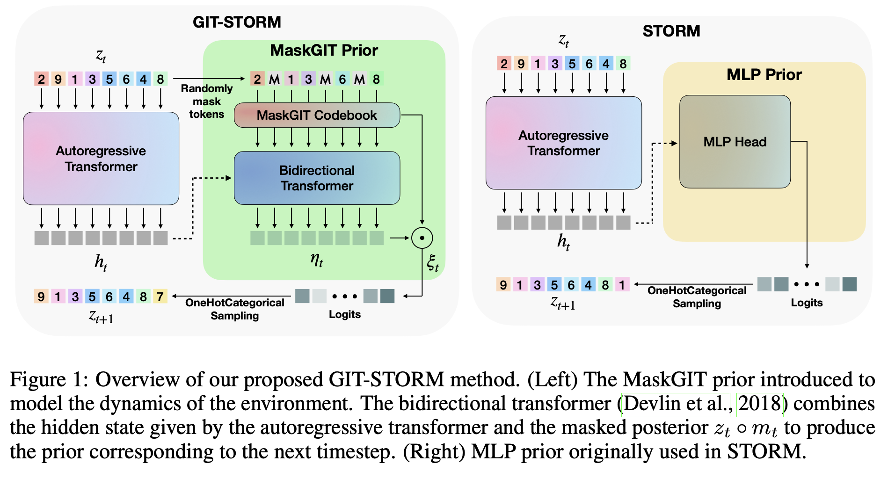

# GIT-STORM: Masked Generative Priors Improve World Models Sequence Modelling Capabilities (Best Paper at ICLR2025 World Models Workshop)

Official implementation of **GIT-STORM**, a novel approach to world modeling for model-based reinforcement learning that leverages MaskGIT as a generative prior for learning stochastic world models.

---

## 📖 Overview

Building on the Efficient Stochastic Transformer-based World Models (STORM) architecture, we replace the traditional MLP prior with a Masked Generative Prior (e.g., MaskGIT Prior) and introduce GIT-STORM. We evaluate our model on two downstream tasks: reinforcement learning and video prediction. GIT-STORM demonstrates substantial performance gains in RL tasks on the Atari 100k benchmark. 

**Paper**: [GIT-STORM Arxiv Link](https://arxiv.org/abs/2410.07836)

### Architecture



The model architecture consists of:
- **Encoder**: CNN-based encoder that processes visual observations into latent representations
- **MaskGIT Transformer**: Masked generative model for learning stochastic latent dynamics
- **World Model**: Transformer-based dynamics model that predicts future latent states
- **Actor-Critic Agent**: Policy network trained in imagination using the learned world model

---

## 🚀 Quick Start

### Prerequisites

- Python 3.10+
- CUDA-compatible GPU (recommended)
- Conda or virtualenv

### Environment Setup

#### Option 1: Using Conda (Recommended)

```bash
# Create and activate the environment
conda env create -f environment.yml
conda activate STORM
```

#### Option 2: Using pip

```bash
# Create a virtual environment
conda create -n STORM python=3.10
conda activate STORM

# Install dependencies
pip install -r requirements.txt
```

### Installation

```bash
# Clone the repository
git clone <repository-url>
cd GIT-STORM

# Install the environment (choose one of the options above)
conda env create -f environment.yml
conda activate STORM
```

---

## 🏋️ Training

### Basic Training

Train a model using the default configuration:

```bash
# Train STORM on Atari Boxing
python train.py BasicSettings.env_name="ALE/Boxing-v5"

# Train GIT-STORM on Atari Boxing
python train.py \
  BasicSettings.config_path="config_files/GITSTORM.yaml" \
  BasicSettings.env_name="ALE/Boxing-v5"
```

### Using Shell Scripts

For convenience, use the provided training script:

```bash
# Usage: ./train.sh <env_name> <seed> <config>
./train.sh Boxing 0 STORM      # Train STORM
./train.sh Boxing 0 GITSTORM   # Train GIT-STORM
```


### Configuration

The training behavior can be customized through YAML configuration files located in `config_files/`:

- `STORM.yaml`: Configuration for baseline STORM model
- `GITSTORM.yaml`: Configuration for GIT-STORM model with MaskGIT prior


### Monitoring Training

Training logs are written to TensorBoard:

```bash
tensorboard --logdir runs/
```

Metrics logged include:
- Episode rewards and lengths
- World model losses (reconstruction, reward prediction, termination prediction)
- Agent losses (policy loss, value loss, entropy)
- Imagination rollouts (videos)

---

## 🧪 Evaluation

### Evaluate Trained Models

Evaluate a trained model across multiple episodes:

```bash
# Basic evaluation
python eval.py \
  -config_path="config_files/STORM.yaml" \
  -env_name="ALE/Boxing-v5" \
  -run_name="Boxing-STORM-seed_0"
```

### Using Shell Scripts

```bash
# Usage: ./evals.sh <env_name> <run_name> <config>
./evals.sh Boxing Boxing-STORM-seed_0 STORM
```

### Batch Evaluation

To evaluate multiple experiments at once, use the evaluation manager:

```bash
# Edit eval_manager.sh to specify environments and seeds
./eval_manager.sh
```

The script will evaluate all checkpoints for each experiment and save results to `outputs/eval_result/<run_name>.csv`.

### Evaluation Metrics

The evaluation script computes:
- Mean episode return across 20 episodes (default)
- Performance across all saved checkpoints
- Results are saved in CSV format for easy analysis

---

## 📊 Reproducing Paper Results

To reproduce the results from the paper:

### Atari 100k Benchmark

```bash
# Train on multiple Atari games with different seeds
for game in Boxing Hero MsPacman Pong Breakout; do
  for seed in 0 1 2; do
    python train.py \
      BasicSettings.env_name="ALE/${game}-v5" \
      BasicSettings.Seed=${seed} \
      BasicSettings.config_path="config_files/GITSTORM.yaml" \
      BasicSettings.n="${game}-GITSTORM-seed_${seed}" \
      JointTrainAgent.SampleMaxSteps=102000
  done
done
```

---

## 📁 Project Structure

```
GIT-STORM/
├── config_files/           # Configuration files
│   ├── STORM.yaml         # STORM baseline config
│   └── GITSTORM.yaml      # GIT-STORM config
├── sub_models/            # Model implementations
│   ├── world_models.py    # World model architectures
│   ├── transformer_model.py
│   ├── attention_blocks.py
│   ├── functions_losses.py
│   └── torch_maskgit/     # MaskGIT implementation
├── agents.py              # Actor-critic agent
├── replay_buffer.py       # Experience replay buffer
├── env_wrapper.py         # Environment wrappers
├── train.py               # Main training script
├── eval.py                # Evaluation script
├── utils.py               # Utility functions
├── requirements.txt       # Python dependencies
├── environment.yml        # Conda environment
└── assets/                # Images and figures
```

---

## 📚 Citation

If you use this code in your research, please cite:

```bibtex
@article{gitstorm2024,
  title={GIT-STORM: Masked Generative Priors Improve World Models Sequence Modelling Capabilities},
  author={[Authors]},
  journal={arXiv preprint arXiv:2410.07836},
  year={2024}
}
```

---

## Acknowledgments

This implementation builds upon:
- [STORM](https://github.com/weipu-zhang/STORM) - STORM: Efficient Stochastic Transformer based World Models 
- [MaskGIT](https://github.com/google-research/maskgit) - Masked Generative Image Transformer
- [DreamerV3](https://github.com/danijar/dreamerv3) - Inspiration for world model architecture
